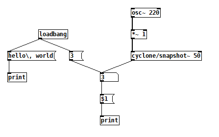
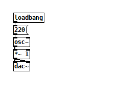

# pdmonad
## Write Pure Data patches in Haskell.

use with:
```
cabal run
```

current patch creation:
```haskell
{-# LANGUAGE OverloadedStrings #-}

module Main where

import PdMonad.Core
import PdMonad.Identifiers as Pd

num = Pd.number # 0
lb = Pd.loadbang # 3
dollarOne = Pd.msg "$1" # 1
hello = Pd.msg "hello, world"
loadedMsg = Pd.msg "999"


main :: IO ()
main =  writePatch "mypatch.pd"
    [
        newCol --> num --> dollarOne --> pdprint # 2,
        newCol --> lb --> hello # 4 --> pdprint # 5,
        newCol --> lb --> loadedMsg # 6 --> num
    ]
```

becomes (thanks to Graphviz auto layouting):




## Non-Native Identifier
Use e.g. ```obj "pack f f f f"``` for creating objects without a (currently) native identifier. Remember to assign the ```objectId```.


# General file structure of a patch


e.g.:
```
#N canvas 940 104 502 581 12;
#X obj 72 67 loadbang;
#X msg 72 91 220;
#X floatatom 72 115 5 0 0 0 - - - 0;
#X obj 72 138 osc~;
#X obj 72 162 *~ 1;
#X obj 72 186 dac~;
#X connect 0 0 1 0;
#X connect 1 0 2 0;
#X connect 2 0 3 0;
#X connect 3 0 4 0;
#X connect 4 0 5 0;
#X connect 4 0 5 1;
```

# Developed/Tested with:
```
GHC 9.4.5
Cabal 3.6.2.0
Pure Data 0.53.1
```
